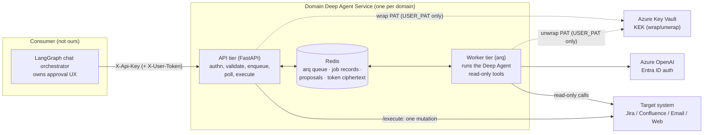
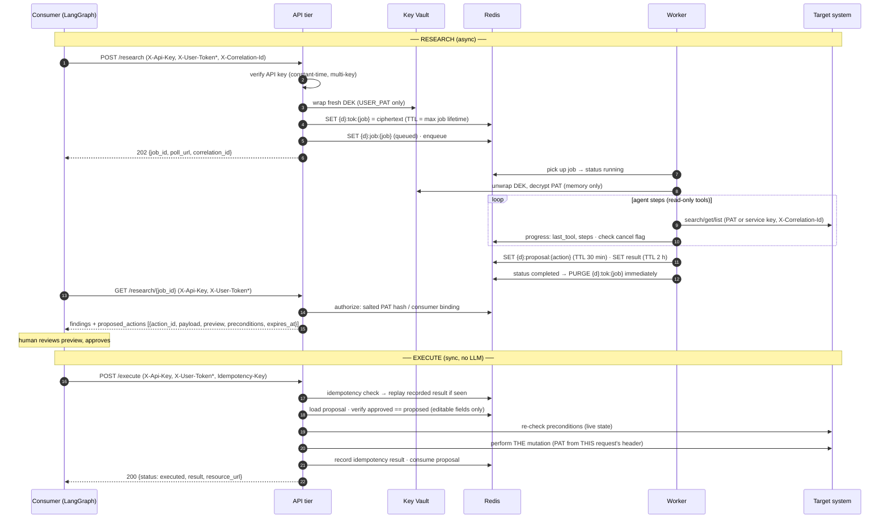
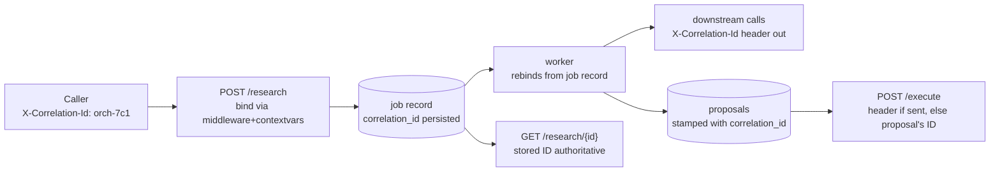

# Domain Deep Agent Service — Blueprint

**This is the team's engineering standard for deep agent services.** Every
domain agent (Jira, Confluence, Email, web search, and whatever comes next)
is an instantiation of this template. Read this once end to end before you
build your first domain; come back to the tables when you're mid-build.

TEMPLATE_VERSION **1.1.0** · audience: developers of mixed seniority ·
companion docs: `README.md` (quickstart), `CONTRIBUTING.md` (Definition of
Done), `docs/adr/` (why the non-obvious decisions are what they are).

---

## 1. What this service is (and is not)

One deployable per domain. It wraps a LangChain **Deep Agents** research
agent behind a small HTTP API with exactly two jobs:

1. **Research** — agentic, asynchronous, **strictly read-only**. A background
   worker runs the deep agent with search/get/list tools only. Output:
   findings plus zero or more fully self-contained *proposed actions*.
2. **Execute** — deterministic, synchronous, **no LLM**. After a human
   approves a proposed action in the consumer's UI, the consumer calls
   `/execute` and this service performs exactly that mutation — validated,
   precondition-checked, idempotent.

The consumer is an external chat application running its own LangGraph
orchestrator. **We do not implement the consumer.** It submits jobs, polls,
runs the approval UX, and calls execute. We never see or store approval
logic.

### Context diagram



Why the split matters: research runs for **minutes** (LLM loops, tool round
trips) and the deployment sits behind APIM/AKS ingress that will not hold
long synchronous connections. A sync `/research` would time out at the
gateway on every nontrivial run. Hence the 202-and-poll job model (ADR-0001).
Execute is a single fast API call, so it stays synchronous.

### Full workflow sequence (including token staging/purge)



`*` = USER_PAT domains only.

---

## 2. Core rules and the failures they prevent

| Rule | The failure it prevents |
|---|---|
| Research toolset is read-only **structurally** (mutation tools simply not bound) | Prompt-based "please don't write" fails the day the model ignores it. A tool that doesn't exist cannot be called — this is enforceable and testable. |
| `/execute` contains **no LLM call** (ADR-0002) | Any model between approval and mutation can execute something other than what the human approved — an audit finding in a regulated environment. |
| Agent run **ends** at research end; no LangGraph interrupt/resume across the boundary (ADR-0003) | Checkpoints held across an unbounded approval window pin memory/state, break autoscaling, leak harness types into the contract, and shatter on version bumps. |
| Proposed actions are **fully self-contained** | If `/execute` had to "look things up" to finish a payload, the executed change would diverge from the previewed one. |
| Queue-based job model (arq on Redis, ADR-0001) | Sync research dies at the ingress timeout; no backpressure means one burst OOMs the API tier; no redelivery means a dead pod silently loses jobs. |
| All domain logic behind `DomainAdapter` (ADR-0004) | Without the seam, every new domain forks the service and fixes stop propagating. |
| Harness behind `agent/factory.py`, exact version pins (ADR-0006) | Harness churn becoming API churn for every consumer; accidental transitive upgrades in a regulated environment. |

---

## 3. API contract

Base rules for **every** endpoint:

- `X-Api-Key` required (except `GET /health/live`). Invalid/missing → `401 INVALID_API_KEY`.
- `X-Correlation-Id` accepted everywhere; caller's value used verbatim, UUID
  generated if absent; echoed in the response header **and** body
  (`correlation_id`), including every error response.
- Errors always use one envelope:

```json
{
  "error": { "code": "STALE_TARGET", "message": "…", "details": { } },
  "correlation_id": "…"
}
```

### 3.1 `POST /research` — submit (async)

Headers: `X-Api-Key` (required) · `X-User-Token` (required **only** for
USER_PAT domains) · `X-Correlation-Id` (optional).

```json
{ "task": "Find why PROJ-1 regressed and propose a fix note",
  "session_id": "chat-session-42",
  "context": {"project": "PROJ"},
  "constraints": {"max_issues": 20} }
```

`202 Accepted`:

```json
{ "job_id": "3f9a…", "status": "queued",
  "poll_url": "/research/3f9a…", "estimated_wait_s": 5,
  "correlation_id": "orch-7c1…" }
```

Behavior in order: authenticate → validate → (USER_PAT) encrypt & stage PAT,
**failing closed with 503 if Key Vault is down** → enqueue → return. The API
tier never runs the agent.

### 3.2 `GET /research/{job_id}` — poll

Authorization branches on auth_mode — this is why the domain declares it:

- **USER_PAT**: `X-User-Token` required; its **salted hash** must equal the
  hash stored at submit. A different user polling your job gets `404
  JOB_NOT_FOUND` — deliberately indistinguishable from "no such job", so job
  IDs are not an existence oracle.
- **SERVICE_CREDENTIAL / NONE**: the job is bound to the submitting API
  key's consumer ID; another consumer gets `404`.

The job's **stored correlation ID is authoritative** and echoed regardless
of what the poll request carried.

States: `queued | running | completed | failed | cancelled`. `running`
includes lightweight progress (`last_tool`, `steps`). `completed`:

```json
{
  "job_id": "3f9a…", "status": "completed", "session_id": "chat-session-42",
  "correlation_id": "orch-7c1…",
  "created_at": "2026-07-03T09:00:00Z", "finished_at": "2026-07-03T09:04:12Z",
  "attempt": 1,
  "findings": {
    "summary": "PROJ-1 regressed after the 2.4 config change…",
    "sources": [{"title": "PROJ-1", "url_or_id": "https://jira…/browse/PROJ-1"}],
    "details": {"issues_reviewed": 4}
  },
  "proposed_actions": [
    {
      "action_id": "b2c4…",
      "action_type": "add_comment",
      "target": {"system": "jira", "id_or_parent": "PROJ-1"},
      "payload": {"issue_key": "PROJ-1", "body": "Root cause: …"},
      "preview": "Comment the root-cause summary on PROJ-1.",
      "preconditions": {"expected_status": "To Do"},
      "expires_at": "2026-07-03T09:34:12Z",
      "editable_fields": ["body"],
      "correlation_id": "orch-7c1…"
    }
  ]
}
```

`failed` carries `error: {code, message}` (e.g. `JOB_TIMEOUT`). Results
persist 2 h, proposals 30 min from completion (both configurable).

### 3.3 `DELETE /research/{job_id}` — cancel (best effort)

Same authorization as poll. The staged token ciphertext is **purged
immediately**, before anything else. A `queued` job finalizes to `cancelled`
on the spot; a `running` job gets a cancel flag the worker honors between
agent steps (`cancel_requested: true` in the response until it lands).
Cancelling a terminal job is a no-op that returns current state.

### 3.4 `POST /execute` — synchronous, deterministic

Headers: `X-Api-Key` · `Idempotency-Key` (**required**) · `X-User-Token`
(USER_PAT only — execute always uses **this request's** token, never a
staged one) · `X-Correlation-Id` (should match the research run; if absent,
the service joins the call to the originating run via the stored proposal).

```json
{ "action_id": "b2c4…", "session_id": "chat-session-42",
  "approved_payload": {"issue_key": "PROJ-1", "body": "Root cause: … (edited by approver)"},
  "approval": {"approved_by": "jane@corp", "approved_at": "2026-07-03T09:10:00Z"} }
```

Processing order (each step's failure mode in §3.6):

0. **Idempotency**: same key + same request → return the recorded result
   (`idempotent_replay: true`). Same key + *different* request → `409
   IDEMPOTENT_REPLAY`. This check runs **before** the proposal lookup so a
   replay still succeeds after the proposal was consumed — otherwise a
   network retry of a successful execute would surface as `ACTION_EXPIRED`
   and the consumer couldn't tell whether the mutation happened.
1. Load proposal; missing/expired/consumed/foreign-principal → `409 ACTION_EXPIRED`.
2. `approved_payload` must match the stored proposal byte-for-byte outside
   `editable_fields` → `409 PAYLOAD_MISMATCH`.
3. Schema-validate the payload (edits could break constraints) → `422`.
4. Re-check live preconditions (issue status, page version…) → `409 STALE_TARGET`.
5. Execute the one mutation via the adapter. Credentials by auth_mode:
   USER_PAT → header PAT; SERVICE_CREDENTIAL → config credential. Downstream
   failure → `502 DOWNSTREAM_ERROR`, **never auto-retried** — the
   idempotency key is the only replay mechanism.
6. Record outcome, consume the proposal (in that order: a crash between the
   two leaves a replayable record, never a double-executable proposal).

`200`:

```json
{ "status": "executed", "action_id": "b2c4…",
  "result": {"issue_key": "PROJ-1", "comment_id": "10001"},
  "resource_url": "https://jira…/browse/PROJ-1?focusedCommentId=10001",
  "idempotent_replay": false, "correlation_id": "orch-7c1…" }
```

### 3.5 Supporting endpoints

- `GET /health/live` — bare liveness, **unauthenticated** (the only one).
- `GET /health` — authenticated: Redis reachability, queue depth (the KEDA
  signal), LLM config state; `503` when Redis is down.
- `GET /actions/{action_id}` — proposal status (same authz as execute).
- `DELETE /actions/{action_id}` — consumer-initiated rejection cleanup.

### 3.6 Error codes (complete)

| Code | HTTP | When |
|---|---|---|
| `INVALID_API_KEY` | 401 | Missing/unknown `X-Api-Key` |
| `MISSING_USER_TOKEN` | 400 | USER_PAT domain, no `X-User-Token` |
| `JOB_NOT_FOUND` | 404 | Unknown job, expired record, **or** authorization mismatch (no oracle) |
| `JOB_TIMEOUT` | — | In `error.code` of a failed job that exceeded its budget |
| `ACTION_EXPIRED` | 409 | Proposal missing, TTL-expired, consumed, or not yours |
| `PAYLOAD_MISMATCH` | 409 | Approved payload differs on non-editable fields |
| `STALE_TARGET` | 409 | Live target state drifted from `preconditions` |
| `IDEMPOTENT_REPLAY` | 409 | Idempotency key reused for a *different* request |
| `UNSUPPORTED_ACTION` | 409 | action_type has no schema in this domain |
| `VALIDATION_ERROR` | 422 | Request/payload failed schema validation |
| `DOWNSTREAM_ERROR` | 502 | Target system failed during precheck/execute |
| `DEPENDENCY_UNAVAILABLE` | 503 | Key Vault or queue down at submit (fail closed) |
| `INTERNAL_ERROR` | 500 | Anything unexpected (details in logs only) |

---

## 4. Authentication — two independent layers

### Layer 1: consumer → this service (always)

Every endpoint except bare liveness requires `X-Api-Key`. Keys are
provisioned **per consumer**, loaded from env/Key Vault at startup as
`{"consumer-id": "secret", …}`, compared with `hmac.compare_digest` against
*every* configured key (constant-time, no early exit → timing doesn't leak
which key matched). Multiple keys are simultaneously active so a consumer
rotates with zero downtime: add new key → consumer switches → remove old
key. The matched key's **ID** (never the key) is bound to the logging
context, so every Splunk record answers "which consumer did this".

### Layer 2: this service → target system (per domain, declared)

Each adapter declares one `auth_mode`; **all** validation, staging, and
authorization branch on it in template core. Never assume a PAT exists.

| | `USER_PAT` | `SERVICE_CREDENTIAL` | `NONE` |
|---|---|---|---|
| Worked example | Jira: acts *as the end user*; consumer forwards the user's PAT in `X-User-Token`; audit trail on the target shows the human, not a bot | Web search: Tavily/Bing key is **service-owned**, from env/Key Vault; caller can't supply it | Public data sources: no downstream credential at all |
| `X-User-Token` | required (`400 MISSING_USER_TOKEN`) | **ignored if sent** | ignored |
| Staged in Redis | ciphertext only, job-scoped (§5) | never | never |
| Poll/cancel authz | salted PAT hash must match submitter | consumer-ID binding | consumer-ID binding |
| `/execute` credential | PAT from the live request header | config credential | — |

---

## 5. Token handling — the one documented exception

**Applies only to USER_PAT domains.** SERVICE_CREDENTIAL / NONE domains have
*no* token path: no `X-User-Token` validation, no Redis token entry, no Key
Vault call anywhere in their job flow (contract-tested).

The rule is "credentials are request-scoped, never persisted." The async
worker model breaks it: the worker that acts as the user runs seconds later
on another pod. ADR-0005 records the sanctioned exception — memorize its
shape, because every shortcut here is a credential-disclosure incident:

1. **Stage (submit):** generate a fresh AES-256-GCM data key per job,
   encrypt the PAT, wrap the data key with the Key Vault KEK
   (`CryptographyClient.wrap_key`, RSA-OAEP-256 — the KEK never leaves Key
   Vault). Store only the ciphertext blob at `{domain}:tok:{job_id}`, TTL =
   max job lifetime. **Key Vault down ⇒ 503, job rejected. Never fall back
   to weaker storage.**
2. **Use (worker):** unwrap at run start; plaintext lives in worker memory
   only; injected into read-tool/MCP headers per call; registered with the
   log redaction filter *before* first use.
3. **Purge (terminal state):** the moment the job hits
   `completed|failed|cancelled`, the ciphertext is deleted. Cancellation
   purges **immediately at the API**, before the worker even notices. TTL is
   the crash backstop, not the mechanism.
4. **Never:** in logs, traces, error messages, results, proposals, or
   telemetry. Redaction middleware scrubs the value from every formatted log
   line, including exception text (a worker crash whose message embeds a
   downstream response must not leak the header it carried).
5. **Execute never reads a staged token** — always the live request header.
   The staging exists solely so *research* can act as the user.
6. **Poll/cancel** compare a **salted hash** of the presented token against
   the job record. We store the hash, never the token, for this purpose.

Why envelope encryption instead of just TTL'd plaintext: a Redis snapshot,
replication stream, or debug `KEYS`/`GET` must never be a credential dump.
With envelope encryption an attacker needs Redis **and** Key Vault unwrap
rights **within the job's lifetime**.

---

## 6. Redis data model, TTLs, and the job state machine

All keys are domain-prefixed so lower environments can share a Redis.

| Key | Content | TTL | Deleted early by |
|---|---|---|---|
| `{d}:job:{job_id}` | job record: status, timestamps, attempt, principal hash, consumer_id, correlation_id, progress, error | result TTL + max run time | — |
| `{d}:result:{job_id}` | findings + proposed actions | 2 h (`RESULT_TTL_S`) | — |
| `{d}:tok:{job_id}` | PAT **ciphertext** (USER_PAT only) | max job lifetime | terminal-state purge (the real path) |
| `{d}:proposal:{action_id}` | proposal + binding (job, consumer, principal hash) | 30 min (`PROPOSAL_TTL_S`) | consumed on execute; consumer rejection |
| `{d}:idem:{key}` | request hash + recorded response | 24 h | — |
| `{d}:cancel:{job_id}` | cancellation flag | job TTL | terminal-state cleanup |
| `arq:queue` | pending jobs (sorted set) | — | consumption; **zcard = KEDA signal** |

State machine (enforced in `RedisStore.transition` — nowhere else):

```mermaid
stateDiagram-v2
    [*] --> queued: POST /research (202)
    queued --> running: worker pickup
    queued --> cancelled: DELETE before pickup
    queued --> failed: enqueue rollback
    running --> running: retry re-entry (worker died)
    running --> completed
    running --> failed: error cap / timeout
    running --> cancelled: flag honored between steps
    completed --> [*]
    failed --> [*]
    cancelled --> [*]

    note right of completed: every terminal transition\npurges {d}:tok and cancel flag
```

Research is read-only, therefore **safe to re-run from scratch**: if a
worker pod dies mid-run, arq redelivers and the runner re-enters `running`
(attempt 2). Attempts cap at `JOB_MAX_ATTEMPTS` (default 2), then `failed`
with a diagnostic. Per-attempt budget `JOB_TIMEOUT_S` (default 10 min) is
enforced *inside* the runner (`asyncio.timeout`) and marks
`failed: JOB_TIMEOUT` — the arq-level timeout is only an outer guard.

Downstream 429s during research back off exponentially inside read tools
(`read_request_with_backoff`, honors `Retry-After`). Mutations are never
auto-retried anywhere.

---

## 7. Observability

### 7.1 Correlation ID lifecycle

One ID spans the entire workflow. The consumer's orchestrator supplies it;
we generate only when absent. `request_id` (fresh per HTTP call) identifies
the call; `correlation_id` groups the workflow.



Propagation is `contextvars` + middleware — the ID is on every log line in
both processes **automatically**; it is never threaded through function
signatures. Persisting it on the job *and* stamping it on every proposal
means `/execute` joins its research run even if the caller forgot the
header.

### 7.2 Canonical log schema (Splunk)

Single-line JSON to stdout (12-factor; AKS log collection forwards to
Splunk — the service never talks to Splunk directly). Exceptions serialize
into a single `exception` field — no multi-line tracebacks, because a
half-indexed traceback is invisible to every query. **Field names never
vary; null fields are allowed** — consistent keys are what make Splunk
queries work.

```json
{"timestamp":"2026-07-03T09:04:12.114+00:00","level":"INFO",
 "service":"domain-deep-agent","domain":"jira","env":"prod",
 "correlation_id":"orch-7c1…","request_id":"9d2e…","job_id":"3f9a…",
 "action_id":null,"consumer_id":"chat-orchestrator",
 "event":"job_completed","duration_ms":252114,"status":"completed",
 "message":"job_completed"}
```

Lifecycle events at INFO: `job_submitted / job_queued / job_started /
agent_step (tool name + duration, never payloads) / job_completed |
job_failed | job_cancelled / proposal_created | proposal_consumed |
proposal_rejected_by_consumer / execute_requested | execute_validated |
execute_succeeded | execute_failed / token_staged | token_purged /
http_request`.

Example Splunk queries:

```
# trace one workflow end to end (submit → worker → poll → execute)
index=agents service=domain-deep-agent correlation_id="orch-7c1…" | sort _time

# all failed executes for one consumer, last 24h
index=agents domain=jira consumer_id="chat-orchestrator" event=execute_failed earliest=-24h

# queue pressure: p95 research duration by domain
index=agents event=job_completed | stats p95(duration_ms) by domain

# token hygiene audit: staged tokens must pair with a purge
index=agents event=token_staged OR event=token_purged | stats count by event, job_id
```

### 7.3 Redaction matrix

| Value | In logs | In Redis | In responses | Mechanism |
|---|---|---|---|---|
| User PAT | never (`[REDACTED]`) | ciphertext only | never | secret registry populated at header-read and worker-unwrap; formatter scrubs every line incl. exception text |
| Service API keys | never | never | never | registered at startup |
| Service downstream credential | never | never | never | held in process config only |
| Payload/user content | **not by default**; only fields in the adapter's reviewed `log_content_allowlist` | proposals/results only (TTL'd) | yes (that's the product) | log identifiers + metadata, not content |
| Identifiers (job_id, action_id, issue keys) | yes | yes | yes | — |

---

## 8. Failure modes

| Failure | Behavior | Why it's safe |
|---|---|---|
| Worker pod dies mid-run | arq redelivers; runner re-enters `running` (attempt n+1); cap `JOB_MAX_ATTEMPTS` → `failed` + diagnostic | research is read-only — re-running from scratch mutates nothing |
| Agent exceeds time budget | `asyncio.timeout` → `failed: JOB_TIMEOUT`; token purged | bounded worst-case cost per job; consumer sees a typed error |
| Redis unavailable | API: 503s (health reports degraded, readiness gates traffic); worker: stalls, no work lost — queue is durable in Redis persistence | jobs are either fully staged or rejected; no half-state |
| Key Vault unavailable | **fail closed**: `POST /research` → `503 DEPENDENCY_UNAVAILABLE` for USER_PAT domains; running jobs that can't unwrap fail | never store the PAT in a weaker form to "keep availability" |
| Downstream 429/5xx during research | exponential backoff in read tools (honors `Retry-After`); per-run concurrency cap (§9.1) prevents self-inflicted 429 storms from parallel fan-out | reads are idempotent; backoff caps per call |
| Downstream failure during execute | `502 DOWNSTREAM_ERROR`, **no auto-retry**; consumer replays with the same `Idempotency-Key` | replaying a mutation without an idempotency record risks double-execution |
| Queue backlog grows | `zcard(arq:queue)` exposed via `/health` and metrics → **KEDA scales worker replicas on queue length** | API tier keeps accepting (bounded by Redis), consumers see honest `estimated_wait_s` |
| Consumer retries submit (network flake) | new job_id each time — submits are not idempotent by design; consumer dedupes on its side | research is read-only; a duplicate run wastes tokens, mutates nothing |
| Proposal approved after TTL | `409 ACTION_EXPIRED` → consumer re-runs research | stale research must not mutate a system that has since moved |
| Target drifted during approval | `409 STALE_TARGET` with expected/actual detail | the human approved a change to the state they saw, not to whatever exists now |

---

## 9. Harness swappability

Deep Agents is the default, not the contract. The worker depends only on
LangGraph's `astream(input, stream_mode="values")` protocol; construction is
funneled through `app/agent/factory.py`:

```python
# swap per domain via AGENT_FACTORY env — zero contract change
def custom_graph_factory(*, model, tools, instructions):
    graph = build_my_langgraph(model, tools, instructions)   # your graph
    return graph.compile()                                   # exposes astream

register_agent_factory("custom", custom_graph_factory)       # AGENT_FACTORY=custom
```

A `react` factory (`langchain.agents.create_agent`) ships registered as
living proof, and the contract suite runs the whole service against a fake
harness — the seam is exercised on every CI run.

**Exact pins** (regulated environment — resolved and bumped only as a set,
gated by the contract suite; see `pyproject.toml`):

```
deepagents==0.6.12   langchain==1.3.11   langgraph==1.2.7
langchain-openai==1.3.3   langchain-mcp-adapters==0.3.0
```

MCP tools: bind via `langchain-mcp-adapters` (`MultiServerMCPClient`),
injecting credentials per auth_mode — the PAT into MCP headers for USER_PAT
domains, the config credential for SERVICE_CREDENTIAL. Same rule as native
tools: research binds **read-only MCP tools only**.

LLM: `AzureChatOpenAI` with **Entra ID auth** (`DefaultAzureCredential` +
bearer token provider) — no API keys anywhere in the LLM path
(`app/llm/azure.py`).

### 9.1 Performance seams: parallel retrieval and model tiering

Two template-core mechanisms cut research latency without touching quality
(mutation quality is floor-guaranteed anyway: `/execute` re-validates schema
and live preconditions regardless of how research ran):

**Parallel retrieval, capped.** The research prompt explicitly instructs the
agent to issue independent lookups concurrently (multiple tool calls per
turn, parallel retriever sub-tasks) instead of serially. What makes that
safe to *encourage* is the per-run concurrency cap: the runner wraps every
read tool in one shared `asyncio.Semaphore(MAX_CONCURRENT_READS)` (default
6, `0` disables) before binding them to the agent
(`app/worker/runner.py:cap_read_concurrency`). Uncapped fan-out trips
downstream 429s, and every 429 costs a backoff sleep that is slower than
briefly queueing at the semaphore. The wrapper preserves each tool's
name/docstring/signature (the harness builds tool schemas from them) — the
contract suite asserts the wrapper is invisible.

**Model tiering.** Configure `AZURE_OPENAI_FAST_DEPLOYMENT` and the deep
agent gains a `retriever` sub-agent on the fast/cheap tier: the main agent
(primary deployment) keeps planning, cross-source synthesis, and action
proposals — where quality actually lives — and delegates retrieval +
per-source summarization, which is mostly extraction. Unset = single-model,
exactly the previous behavior. The fast model flows through the same factory
seam (`fast_model` parameter), so custom harnesses may use or ignore it —
the registered `react` factory ignores it by design.

---

## 10. Adding a new domain in 5 steps

`make new-domain NAME=confluence` scaffolds all files below; the steps are
what you fill in. Full checklist: CONTRIBUTING.md.

1. **Implement the adapter** (`app/adapters/confluence.py`): declare
   `auth_mode` deliberately; write read-only tools (`read_tools`) using
   `read_request_with_backoff`.
2. **Register action schemas**: one Pydantic model per mutation in
   `action_schemas()`; choose `editable_fields` per action (empty = nothing
   editable).
3. **Define read tools' counterpart — executors and preconditions**:
   `execute()` performs the single mutation; `check_preconditions()`
   compares live state (page version!) against what research recorded.
4. **Make the shared contract suite green**: flesh out your `ContractCase`
   in `tests/contract/cases.py` (offline mock transports, canned agent
   output). `tests/contract/` itself must pass **unchanged** — that suite
   *is* the definition of "this is a compliant domain agent".
5. **Deploy**: same image, two AKS deployments (API: `uvicorn app.main:app`;
   worker: `arq app.worker.main.WorkerSettings`), `DOMAIN=confluence` plus
   your config block; KEDA scaler on `arq:queue` length.

---

## 11. Non-goals (explicit)

- **No approval logic here.** The consumer owns the human-in-the-loop UX
  entirely. Every mutation requires explicit human approval — there are no
  auto-approve tiers, and this service couldn't add one if asked: it has no
  approval concept beyond "a proposal was executed or it expired".
- **No LangGraph interrupt/resume across the service boundary** (ADR-0003).
  The agent run ends when research ends, full stop.
- **No long-lived credential storage.** The only credential that ever
  touches disk-adjacent storage is the job-scoped, Key Vault-wrapped PAT
  ciphertext of §5, purged at terminal state. No caches, no sessions, no
  "remember the token for the next job".
- **No consumer implementation.** We publish a contract; the orchestrator on
  the other side is someone else's codebase.
